<div align="center">



*Your whole Stash library in your pocket... browse, play, rate, and edit it all from one Android app.*

</div>

---

<!--
## Screenshots

<div align="center">

| | |
|:-:|:-:|
|  |  |
|  |  |

</div>

---
-->

## What it does

PocketStash is a native Android client for a self-hosted [Stash](https://github.com/stashapp/stash).
It talks straight to Stash's GraphQL API, so there's nothing extra to run on your server. It covers
browsing, playback, and editing: scenes, performers, studios, tags, groups, galleries, images, and
markers, in one app made for a phone. It works over plain HTTP, so a Tailscale address is all you need.

## Features

| | |
|---|---|
| 🏠 **Custom Home** | Keep the default Home (continue watching, recently added, newest, random, favorites, top rated, galleries, markers) or build your own. Add carousels of any entity type with their own sort, filters, search text, item count, and card size, plus stats and shortcut sections. Reorder, hide, duplicate, and copy a layout to another device. |
| 📚 **Browse** | Scenes, performers, studios, tags, groups, galleries, images, and markers. Infinite scroll, search, every useful sort, ascending or descending, a stable random sort with reshuffle, quick filters (unwatched, in progress, rated, organized, favorites), and pull to refresh. |
| 🔍 **Search** | One box that searches all eight types at once, with "See all" for each. |
| 🎞️ **Scene page** | Play or resume, play from the start, star rating, O counter, organized toggle, play count and watch time, performers, tags, markers (tap to jump), linked galleries and groups, details, URLs, and full file info. |
| 🎬 **Player** | Double-tap to skip (5s back / 15s ahead, keep tapping to keep going), swipe for brightness and volume, **hold for 2×**. **Scrub previews** from Stash's sprite sheets, **marker chapters** on the seek bar with previous/next, **A–B loop**, and **frame-by-frame** stepping while paused. Controls hide when paused too, so you can look at the frame. **Subtitles** and **audio tracks**, speed (0.5×–2×), all **remembered per scene**, plus a **sleep timer**. **Play all / Shuffle** any scene list into a queue with auto-next and an Up next sheet (offline too). Picture-in-picture with back, play/pause and forward buttons. |
| 📡 **Streams** | Tries the direct file first and falls back through Stash's transcodes (HLS, DASH, MP4, WebM) when the phone can't decode it. You can also pick a stream yourself. |
| ⏱️ **Play tracking** | Resume points, play counts, and watch time are sent back to Stash, so the web UI and the app stay in step. |
| 🔖 **Markers** | Add a marker at the current spot without leaving the player, or from the scene page. Edit or delete any marker. |
| 👤 **Detail pages** | Performers, studios, tags, groups, and galleries with full metadata, ratings, favorites, parent and child studios and tags, and tabbed grids of everything related, all in one scroll. |
| 🖼️ **Image viewer** | Swipe through any image list (a gallery, a performer's images, search results) with pinch and double-tap zoom, ratings, and O counter. Video clips open in the player. |
| ✏️ **Editing** | Everything the web UI can edit: scenes, performers, studios, tags, groups, galleries, images, and markers. Search-as-you-type pickers create missing tags, performers, studios, and groups on the fly. Upload covers and images from the phone or a URL. |
| ➕ **Create & delete** | New performers, studios, tags, groups, and galleries from their lists. Deleting scenes, images, and galleries can also remove the file and generated previews. |
| 📐 **Any aspect ratio** | Portrait (9:16), 4:3, and ultrawide videos show whole, letterboxed on a dark backdrop instead of cropped. |
| ⬇️ **Downloads** | Download any scene for offline playback: the original file (resumes if interrupted) or a smaller MP4 from Stash's transcodes. Downloads run in the background with a progress notification, wait for Wi-Fi by default, and get their own screen with sizes, free space, pause and retry. Saved scene lists can download their videos too. |
| 📴 **Offline mode** | When your server can't be reached (or you switch it on yourself), downloads and saved lists **become the whole library** for that session. Browsing, search, every sort including random, filters, detail pages and stats all run on what's on the phone. Scenes without a video show as info only, editing is put away, and plays and watch time are sent once you're back. A pill tells you when the server is back, with a one-tap **Go online**. |
| ⬇️ **In-app updates** | Checks GitHub Releases on launch, when you come back after 30 minutes, and every 6 hours. With notifications on, new builds pop up in the app: **Update now**, **Later**, or **Skip this build**. Choose the **Stable** channel (tagged releases, whose notes list every commit since the last one) or **Nightly** (every push). |
| 🔒 **Privacy & security** | An **app lock**: your own passcode, or your fingerprint through Android's biometric prompt (with the phone's screen lock as a fallback). It's asked when the app opens and whenever it comes back from the background, after a delay you pick, and playback pauses while locked. **Hide the preview in recent apps** so the app switcher shows a blank card, and optionally **block screenshots**. |
| ⚙️ **Settings** | Searchable, with a live connection card (Stash version and ping) and one page per topic: server, appearance with a live card-size preview, player, library stats, storage & offline with a usage meter, updates, and about. Long-press any setting to reset it. |
| 🎨 **Themes** | Dark ink theme with 16 accent colors. |
| 🌐 **Networking** | Plain HTTP on your LAN or Tailscale, user-installed CAs for self-signed HTTPS, and an option to rewrite media URLs when Stash reports a different host (reverse proxies, Docker). |

---

## Install

Grab the APK from the latest [Release](../../releases) or from the newest **Build APK** run under
[Actions](../../actions). Open it on your phone and allow installs from that app when asked.

Or build it yourself:

```bash
git clone https://github.com/FrameEnder/PocketStash.git
cd PocketStash
./gradlew :app:assembleDebug        # → app/build/outputs/apk/debug/
```

Needs JDK 17 and the Android SDK (platform 35). Android Studio sets up both. The debug build installs
as a separate app (`com.frameender.pocketstash.debug`), so it can sit next to the release build.

**Requirements:** Android 8.0 or newer, and **Stash v0.27 or newer** (the version where groups
replaced movies). Performer editing uses Stash's newer `career_start` / `career_end` fields, so keep
Stash up to date.

---

## First run

1. Enter your server (e.g. `http://100.x.y.z:9999`) and your API key, then tap **Connect**.
   The key is under **Stash → Settings → Security → API Key**. Leave it blank if authentication is off.
2. Browse from the bottom bar: **Home**, **Scenes**, **Performers**, **Search**, and **Library**.
3. Pick a highlight color under **Settings → Appearance**, and lay out Home with the layout button at the top of Home.
4. To watch without your server, open a scene and tap **Download**. To keep a whole list, tap the save-for-offline button at the end of its sort and filter chips.
5. Offline mode turns on by itself when the server can't be reached, or switch it on under **Settings → Storage & offline**.

---

## Player gestures

| Gesture | Does |
|---|---|
| Tap | Show or hide the controls (playing or paused) |
| Double-tap left / right | Skip back 5s / ahead 15s. Each extra tap within a moment skips again. |
| Hold a finger on the video | Play at 2× until you let go |
| Swipe up or down on the left | Brightness (only inside the player) |
| Swipe up or down on the right | Volume. Turning it up while muted unmutes. |
| Drag the seek bar | Scrub with a preview frame; gold ticks are markers, teal is the A–B loop |
| ‹M / M› | Previous / next marker |
| A–B | First tap sets A, second sets B and loops, third clears |
| ‹F / F› (paused) | Step one frame back / forward |
| ⋮ | Speed, subtitles, audio, quality, sleep timer, rotate, picture-in-picture |

---|---|
| Tap | Show or hide the controls |
| Double-tap left / right | Skip back 5s / ahead 15s. Each extra tap within a moment skips again. |
| Swipe up or down on the left | Brightness (only inside the player) |
| Swipe up or down on the right | Volume. Turning it up while muted unmutes. |
| Drag the seek bar | Scrub; white ticks are markers |

---

## Building with GitHub Actions

Every push to `main` builds a release APK. Pushing a tag like `v0.2.0` also publishes it as a GitHub Release.

To keep updates installable over each other, sign every build with your own key. Create it once:

```bash
keytool -genkeypair -v -keystore pocketstash.jks -alias pocketstash -keyalg RSA -keysize 4096 -validity 10000
base64 -w0 pocketstash.jks | gh secret set PS_KEYSTORE_B64
gh secret set PS_KEY_ALIAS --body pocketstash
gh secret set PS_KEYSTORE_PASSWORD
gh secret set PS_KEY_PASSWORD
```

| Secret | What it is |
|---|---|
| `PS_KEYSTORE_B64` | the keystore, base64-encoded |
| `PS_KEYSTORE_PASSWORD` | keystore password |
| `PS_KEY_ALIAS` | key alias (`pocketstash`) |
| `PS_KEY_PASSWORD` | key password (same as the keystore's unless you set one) |

Without these, builds still work but are signed with a throwaway key, so you'd have to uninstall
before each update. Keep `pocketstash.jks` backed up; `.gitignore` already excludes it.

---

## How it's built

| | |
|---|---|
| **UI** | Kotlin, Jetpack Compose, Material 3. Space Grotesk and JetBrains Mono. |
| **Network** | OkHttp and kotlinx.serialization, with hand-written GraphQL documents ([`Queries.kt`](app/src/main/java/com/frameender/pocketstash/data/Queries.kt), [`Edit.kt`](app/src/main/java/com/frameender/pocketstash/data/Edit.kt)) validated against Stash's own schema. |
| **Media** | Coil 3 for images, Media3 ExoPlayer (HLS and DASH) for video, sharing one authenticated OkHttp client. |
| **Editing** | One form engine renders every entity from a field list that mirrors Stash's `*UpdateInput` types. |
| **State** | A small app container plus a ViewModel per screen. Settings and the Home layout live in DataStore. Update checks and offline refreshes run in WorkManager. |
| **Offline** | Offline mode swaps the server for a local library: raw GraphQL results for downloaded and saved items are stored as JSON ([`OfflineLibrary.kt`](app/src/main/java/com/frameender/pocketstash/data/OfflineLibrary.kt)), and [`OfflineQuery.kt`](app/src/main/java/com/frameender/pocketstash/data/OfflineQuery.kt) answers the same queries the server would (search, sorts, filters, counts, stats). Downloads run in a WorkManager foreground worker ([`SceneDownloads.kt`](app/src/main/java/com/frameender/pocketstash/data/SceneDownloads.kt)). |

```
app/src/main/java/com/frameender/pocketstash/
  data/     GraphQL client, queries, models, settings, edit specs, Home layouts, updater
  player/   the player activity and its gesture controls
  ui/       navigation, theme, shared components, one folder per screen
meta/       README banner and the script that draws it
```

The animated banner comes from [`meta/tools/banner.py`](meta/tools/banner.py)
(`cd meta/tools && python3 banner.py ../main.svg`).

---

## Updates & releases

The app updates itself from this repo's GitHub Releases (**Settings → Updates**).

| Channel | Comes from | Made by |
|---|---|---|
| **Stable** | the latest release; its notes list every commit since the previous `v*` tag | pushing a tag: `git tag v0.2.0 && git push origin v0.2.0` |
| **Nightly** | the rolling `nightly` pre-release | every push to `main` (the workflow replaces it automatically) |

Each build's APK is named `PocketStash-<build>.apk`, where the build number is the Actions run number
and also the app's `versionCode`. The app offers an update when a release's APK has a higher number
than the installed one. Updates only install over each other when every build is signed with the same
key (see the signing secrets above).

With **Check for updates automatically** and **Notify me about new builds** both on, a new build also pops up
in the app. **Later** hides it until the app next opens; **Skip this build** hides it for good (a newer build
still shows, and **Updates → Show again** undoes it).

While the repo is **private**, GitHub won't serve releases anonymously. Either make the repo public or
paste a fine-grained token (read-only **Contents** access to this repo) under **Updates → Source**.

---

## Troubleshooting

| Problem | Fix |
|---|---|
| "Can't reach …" when connecting | The phone can't reach the server. Check that Tailscale (or your VPN) is connected, and that the address opens in the phone's browser. Stash's default port is `9999`. |
| "Unauthorized (401)" | The API key is wrong or missing. Copy it again from **Stash → Settings → Security**. |
| Lists load but thumbnails or videos don't | Stash is handing out URLs with a different host (reverse proxy, Docker). Make sure **Settings → Network → Rewrite media URLs** is on (it is by default). |
| A video won't play | The app already falls back through Stash's transcodes. If none work, pick another stream from the player's quality button, or check that ffmpeg works in Stash. |
| Videos have no sound | Tap the speaker button in the player, or swipe up on the right side. |
| Saving a performer fails | Update Stash; older versions don't know the `career_start` / `career_end` fields. |
| A scene says "Info only" offline | It was saved with a list but its video wasn't downloaded. Download it, or tick **Also download the videos** when saving a scene list. |
| Offline mode is missing things | Offline, only downloads and saved lists exist. Tap **Go online** on the pill when the server is back, or turn off **Offline mode** in **Settings → Storage & offline**. |
| Downloads say "Waiting for Wi-Fi" | **Wi-Fi only** is on (the default). Turn it off on the Downloads screen to use mobile data. |
| A downloaded MP4 takes a long time | Stash converts MP4 downloads while sending them. The **Original file** option is fastest, and resumes if interrupted. |
| Forgot the app passcode | On the lock screen, tap **Forgot passcode?** and confirm with your phone's screen lock (Android 10+). The passcode is removed so you can set a new one. |
| "No release found" in Updates | The repo is private. Add a GitHub token under **Updates → Source**, or make the repo public. |
| A new APK won't install over the old one | The builds were signed with different keys. Set up the signing secrets, then uninstall once. |

---

<div align="center">

**PocketStash** · your stash, wherever you are.

</div>
